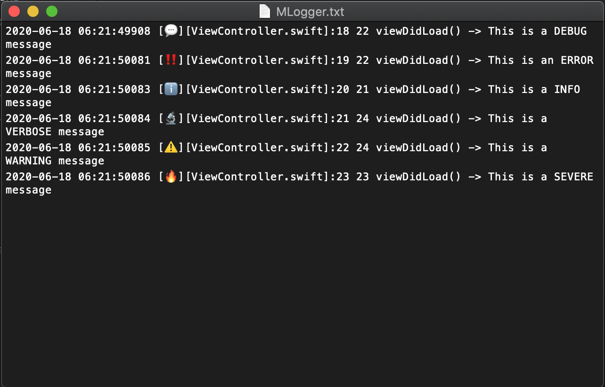

# MLogger

[](https://travis-ci.org/dwyl/esta)
[](https://cocoapods.org/pods/MLogger)
[](https://cocoapods.org/pods/MLogger)
[](https://cocoapods.org/pods/MLogger)

### What is MLogger 
MLogger is  a tiny logger for testing cases and following the logs on the console and saves them into a local .text file.

## Example

To run the example project, clone the repo, and run `pod install` from the Example directory first.

## Requirements
- IOS 10.0+ 
- Xcode 9.0

## Installation

MLogger is available through [CocoaPods](https://cocoapods.org). To install
it, simply add the following line to your Podfile:

```ruby
pod 'MLogger'
```
## Usage

### Basic
> If you are using CocoaPods to integrate MLogger. Import MLogger first:
> ```swift
> import MLogger
> ```

```   
 // Basic Usages
  MLogger.debug("This is a DEBUG message") // DEBUG log
  MLogger.error("This is an ERROR message") // ERROR log
  MLogger.info("This is a INFO message") // INFO log
  MLogger.verbose("This is a VERBOSE message") // VERBOSE log
  MLogger.warning("This is a WARNING message") // WARNING log
  MLogger.severe("This is a SEVERE message") // SEVERE Error log
```

```
// Log on Xcode Console
2018-06-09 01:03:37694 [💬][AppDelegate.swift]:20 15 application(_:didFinishLaunchingWithOptions:) -> This is a DEBUG message
2018-06-09 01:03:37722 [‼️][AppDelegate.swift]:21 15 application(_:didFinishLaunchingWithOptions:) -> This is an ERROR message
2018-06-09 01:03:37723 [ℹ️][AppDelegate.swift]:22 15 application(_:didFinishLaunchingWithOptions:) -> This is a INFO message
2018-06-09 01:03:37724 [🔬][AppDelegate.swift]:23 15 application(_:didFinishLaunchingWithOptions:) -> This is a VERBOSE message
2018-06-09 01:03:37724 [⚠️][AppDelegate.swift]:24 15 application(_:didFinishLaunchingWithOptions:) -> This is a WARNING message
2018-06-09 01:03:37725 [🔥][AppDelegate.swift]:25 15 application(_:didFinishLaunchingWithOptions:) -> This is a SEVERE message

```
### How to get the MLogger.text file path 


```
//MARK:- Print the Mlogger.text file path into the console

MLogger.printMloggerFilePath()
```

## Author

Mahmoud Abdelshafi, Email: mahmoudabdelshafi4@gmail.com

## License

MLogger is available under the MIT license. See the LICENSE file for more info.
